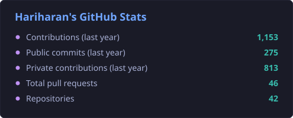
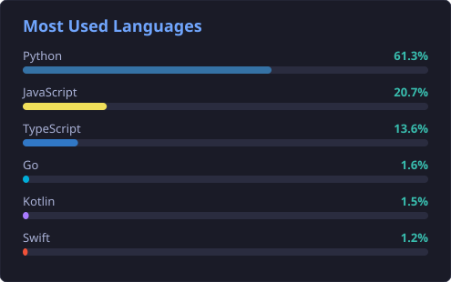

<h1 align="center">Hi 👋, I'm Hariharan Loganathan</h1>
<h3 align="center">AI Engineer · Founding Engineer @ GeneGenius · MSCS @ NYU '26 · Ex-Zenoti</h3>

---

### 🧠 About Me

- 🧬 **Founding Engineer @ GeneGenius**: early-stage AI platform for clinical genomic variant interpretation (NVIDIA Inception member)
- 🤖 I build **agentic LLM systems**: RAG pipelines, LangGraph agents, real-time voice+vision AI, and LLM evaluation platforms
- 🎓 M.S. in Computer Science @ **NYU** (2024–2026) · TA for Information Visualization & Information Security
- 🏗️ 3 years @ **Zenoti** as a Software Engineer: C#/.NET microservices, Kafka event pipelines, and high-throughput backend systems serving 1,000+ globally distributed nodes
- 🌱 Contributing to open source: **[DSPy](https://github.com/stanfordnlp/dspy)** (Stanford NLP)
- ⚡ Fun fact: My side projects have <100ms latency. My sleep schedule doesn't.

---

### 🌐 Connect with Me

---

### 🚀 Highlight Projects

#### 🗽 [City Witness](https://github.com/hariharan-brucewayne220/city_pulse): Real-Time Voice+Vision AI Agent
> Point your camera at anything in NYC; the agent sees it, narrates live, and pulls city data for that exact location
- Gemini Live API (bidirectional audio+vision streaming) + NYC Open Data (311, inspections, crime stats)
- Voice follow-up Q&A grounded in live civic data
- 🛠️ Python · FastAPI · Gemini Live · Google ADK · MCP · DuckDB · Cloud Run
- 🏆 Built at NYC Build With AI Hackathon, NYU Tandon

#### 📞 [RevLens](https://github.com/hariharan-brucewayne220/rev-lens): Multi-Tenant Sales Call Intelligence SaaS
> B2B SaaS that turns raw sales calls into pipeline health scores, objections, and buying signals
- 3-stage Inngest event pipeline: Whisper transcription → GPT-4o structured analysis → health score deltas
- Org-scoped data isolation, role-gated APIs, AES-256-GCM encryption, 20+ model Prisma/PostgreSQL schema
- 🛠️ Next.js · TypeScript · Inngest · Whisper · GPT-4o · Prisma · PostgreSQL

#### 📡 [Distributed API Monitor](https://github.com/hariharan-brucewayne220/distributed-api-monitor): Go ML-Serving Health Monitor
> Low-latency monitoring system simulating model-serving health across 1,000+ endpoints
- Goroutine-per-endpoint fan-out, buffered channel backpressure, graceful shutdown
- Prometheus metrics, gRPC streaming, 3-tier AI degradation (OpenAI → local GGUF → rule-based)
- 🛠️ Go · Prometheus · gRPC · Docker · PostgreSQL

#### 💰 [AI Financial Advisor](https://github.com/hariharan-brucewayne220/ai-financial-advisor): RAG Platform with LangGraph Agents
> Document-grounded financial Q&A with sub-second retrieval and citation-backed answers
- Hybrid retrieval: dense embeddings + BM25 + HyDE with RRF reranking
- LangGraph agents for multi-step reasoning and automated report generation
- 🛠️ FastAPI · React · pgvector · Redis · LangGraph · AWS

#### 📈 [MacroDash](https://d389ljtx6u31j8.cloudfront.net/): Agentic AI Investment Research Platform (Live)
> Daily BUY/SELL/HOLD recommendations from news sentiment + 14,000+ FRED macro indicators
- Agentic LLM workflow with ARIMA forecasting via scheduled background jobs
- 🛠️ Django REST · React · PostgreSQL · Redis · AWS (CloudFront, S3, EC2)

#### 🎮 [AI Gesture Gaming Controller](https://github.com/hariharan-brucewayne220/ai-gesture-gaming-controller): CV + ML Game Input
> Full keyboard/mouse replacement: hand gestures, wink detection, head tracking, and voice commands
- 5-thread lock-free architecture fusing MediaPipe landmarks, LSTM sequence model, and 3 STT engines at 60 FPS
- 🛠️ Python · MediaPipe · PyTorch · OpenCV · Vosk · Whisper

#### 🔍 [Sentinel](https://github.com/hariharan-brucewayne220/sentinal-anomoly-detection): Production MLOps Pipeline
> End-to-end anomaly detection with drift monitoring and automated deploys
- Isolation Forest on NAB sensor data (ROC-AUC 0.82), MLflow tracking + model registry
- Evidently drift alerts → Slack, full CI/CD via GitHub Actions
- 🛠️ MLflow · Evidently · Docker · GitHub Actions · Railway

---

### 🌱 Open Source

- **[DSPy](https://github.com/stanfordnlp/dspy)** (Stanford NLP): fixes for multimodal file/video block handling ([#9903](https://github.com/stanfordnlp/dspy/pull/9903)) and chat-history formatting in system prompts ([#9905](https://github.com/stanfordnlp/dspy/pull/9905))

---

### 🧰 Tech Stack

**Languages**

**AI / LLM**

**Backend & Data**

**Frontend**

**Cloud & DevOps**

---

### 📊 GitHub Stats

  
  

Stats generated weekly from the GitHub API by <a href=".github/workflows/update-stats.yml">a GitHub Action</a>.

---

> *"I build systems that think. Then I teach them to listen."*
